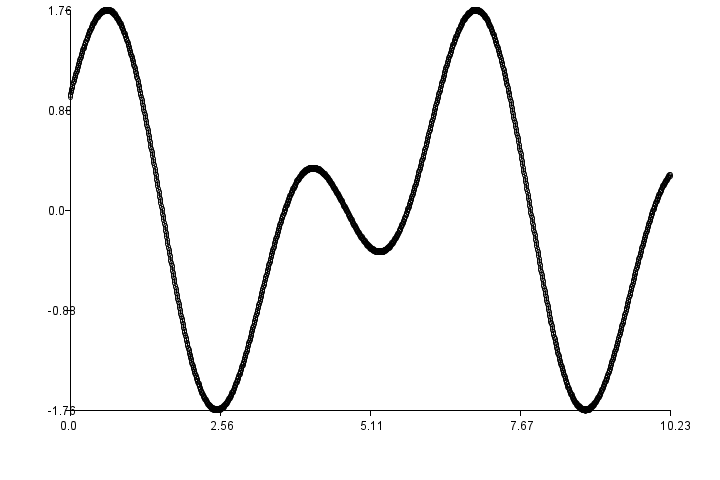

**JForth**
----------

This is a pretty bloated Forth interpreter that supports also loops and various data types.

The original code is from: http://linuxenvy.com/bprentice/JForth/

Sorry, there's no documentation. In order to see how things work, please take a look at the test cases
in ForthTestCases.java
                       
 <h4>PLEASE NOTE: This is the GUI version!
 The text mode verion is no longer supported!
</h4>

Have fun.

Currently supported data types
------------------------------
`As of JForth, Build: 2734, Input can be typed using the following notations:`

Long
> Ex: 1234  
0xffd2 ( hex input)  
0b1100101 ( binary input)   
01:00:00 ( equals 3600, timer value hh:mm:ss) 
12M (equals to 12000000, aka 12 Million) 
4K (equals to 4000, aka 4 Thousand)

Double
> Ex: 123.456 

BigInt
> Ex: 123456789012345678901234567890L

DoubleSequence
> Ex: {1,2,4.456,7}
 
DoubeMatrix
> Ex: {{1,2,4}{5,8,9}} 

StringSequence
> Ex: {a,b,hello,666}

FracSequence
> Ex: {1/2,22,7}

MixedSequence
> Ex: {"hello";{1,2,3};0.123;7;3x-8}
> note the ';' as delimiter.

PolynomialFunction
> Ex: 2x^3-x^2+7x-9 

Complex
> 12+6i

Fraction
> 3/4

String
> "hello"   
> or hello (without quotes) if not defined as forthword)

Comment (not a real data type)
> ( a comment: open bracket, space, text, close bracket)   
>( another comment: open bracket, space, text, space, close bracket )   
>\\ comment out everything until line end

Predefined Words
------------------------------

<pre>

JFORTH> wordsd .

!               -- Store value into variable or array
'               -- Push word from dictionary onto stack
(               -- Begin comment
*               -- Multiply TOS and TOS-1
+               -- Add 2 values on stack
+!              -- Add value to variable
+LOOP           -- adds value to loop counter i
-               -- Substract values
.               -- Pop TOS and print it
."              -- String output
.S              -- Show whole data stack
.V              -- Show whole variable stack
/               -- Divide TOS-1 by TOS
/MOD            -- Dividend and Remainder
0<              -- Gives 1 if TOS smaller than 0
0=              -- Gives 1 if TOS is zero
0>              -- Gives 1 if TOS greater than zero
1+              -- Add 1 to TOS
1-              -- Substract 1 from TOS
1/              -- calculate inverse
2*              -- Multiply TOS by 2
2+              -- Add 2 to TOS
2-              -- Substract 2 from TOS
2/              -- Divide TOS by 2
2DUP            -- Duplicate upper 2 elements
2OVER           -- Copy TOS-2 & TOS-3 to TOS & TOS-1
2ROT            -- Rotates first 3 pairs of elements
2SWAP           -- Swaps first 2 pairs of elements
:               -- Begin word definition
;               -- End word definition
<               -- gives 1 of TOS-1 smaller than TOS
<.              -- Restore last stack object
<<              -- Rotate left
<>              -- 1 if TOS is not equal to TOS-1
=               -- 1 if TOS is equal to TOS-1
>               -- 1 if TOS-1 is bigger than TOS
>>              -- Rotate right
>R              -- Put TOS to variable stack
?               -- immediately print variable content
?DUP            -- Duplicate TOS if not zero
@               -- Put variable value on stack
ABS             -- Absolute value
ACCEPT          -- Read string from keyboard
ACOS            -- Inverse cosine
AGAIN           -- Go back to BEGIN (infinite loop)
ALTSUM          -- Add all elements together but alternates sign
AND             -- Binary and of 2 values
APPLY           -- Apply polynomial to sequence
ARAB            -- make arab number from roman
ARRAY           -- Create array
ASIN            -- Inverse sine
ASK             -- Show yes/no box
ASYNCMSG        -- Show asynchronous message box
ATAN            -- Inverse tangent
ATAN2           -- Second arctan, see: https://de.wikipedia.org/wiki/Arctan2
B64             -- make Base64 from String
BEEP            -- play single tone
BEGIN           -- Marks the start of an indefinite loop.
BF              -- execute brainfuck code
BIG             -- BigPrint
BIN             -- Set number base to 2
BINOMIAL        -- n choose k
BINSTR          -- Make binary String
BKG             -- set background color
BLOBNAME        -- puts blob's path name on stack
BREAK           -- Breaks out of the forth word
BYE             -- End the Forth interpreter
C               -- Speed of light in m/s
CGROUP          -- Make cyclic group from generator and mod value
CLEAR           -- Clear the stack
CLLTZ           -- Get collatz sequence
CLOSEBYTEREADER -- Close file
CLOSEREADER     -- Close file
CLOSEWRITER     -- Close file
CLS             -- clear screen
COLLECT         -- collects all numbers or strings from stack into sequence
COMPLEX         -- Create a complex from 2 numbers
CONJ            -- Conjugate of complex or MyFraction
CONSTANT        -- create new Constant
COS             -- Cosine
COSH            -- Cosinus hyperbolicus
CR              -- Emit carriage return
CROSSP          -- Cross product of 3D vectors
CTAB            -- Makes multiplicative group Cayley table matrix of order n
DEC             -- Set number base to 10
DEPTH           -- number of elements currently on the stack
DETM            -- Determinant of a Matrix
DIAGM           -- Create diagonal Matrix from List
DIR             -- Get directory
DO              -- Sets up a finite loop, given index and limit.
DOTP            -- Dot product of 3D vectors
DROP            -- remove TOS
DTMF            -- create DTMF sound
DUP             -- Duplicate TOS
E               -- Natural logarithm base
EDITOR          -- Enter line editor
ELSE 
EMIT            -- Emit single char to console
ERR             -- Put last error message onto stack
EXECUTE         -- executes word from stack
EXP             -- E^x
F'=             -- Derive a polynomial
F2=             -- evaluate term with 2 arguments
F2L             -- frequency to wave length & vice versa
F=              -- evaluate term
FACT            -- Factorial
FACTOR          -- Prime factorisation
FALSE           -- Gives 0
FIB             -- Fibonacci number
FITPOLY         -- Make polynomial sequence of Points
FLUSH           -- pops and shows whole stack
FONT            -- set font
FORGET          -- Delete word from dictionary
FORTH           -- execute forth line asynchronously
FRACTRAN        -- Run Fractran language
FREE            -- Get anount of free heap mmeory
GAMMA           -- Gamma funcction
GAUSSIAN        -- Gaussian random number
GBOX            -- (Graphics) draw box
GCD             -- Greates common divisor
GCIRCLE         -- (Graphics) draw circle
GCLEAR          -- (Graphics) clear canvas
GCOLOR          -- (Graphics) set drawing color
GDISC           -- (Graphics) draw disc
GDRAWTO         -- (Graphics) draw line from prev x/y to new x/y
GETBLOB         -- read blob into memory
GF*             -- Galois multiplication of TOS and TOS-1
GF+             -- Galois addition TOS-1 + TOS
GF-             -- Galois subtraction TOS-1 - TOS
GF/             -- Galois division TOS-1 by TOS
GLINE           -- (Graphics) draw line
GMEAN           -- Geometric mean
GOUT            -- (Graphics) put canvas onto stack
GPLOT           -- (Graphics) plot x/y
GRAY            -- make gray code
GRECT           -- (Graphics) draw rectangle
GSTAMP          -- (Graphics) draw image to canvas
HASH            -- generate hash string
HEX             -- Set number base to 16
HEXSTR          -- Make hex string
HTTP            -- run web server
HUMBIN          -- Shows large byte amaounts human readable based on 1024
HUMSI           -- Shows large byte amounts human readable based on 1000
I               -- put loop variable i on stack
IDM             -- Create Identity Matrix
IF 
IGROUP          -- calculate inverses of a group
IMGSCALE        -- set Image Scale
INTERSECT       -- Make intersection of 2 sequences
INVM            -- Inverse of a Matrix
IROT            -- Rotate  image by 90 degrees
ISPRIME         -- Primality test
ISWAP           -- mirrors an image
J               -- put loop variable j on stack
JAVA            -- compile and run java class
JS              -- evaluate js expression string
JSON            -- Convert to JSON
JSON2           -- Convert to JSON
KEY             -- Get key from keyboard
LAGPOLY         -- Make lagrange polynomial sequence of Points
LCM             -- Least common multiple
LEAVE           -- Terminate the loop immediately
LENGTH          -- Get length of what is on the stack
LFONTS          -- Show all system fonts
LIST            -- Put program in editor on stack
LN              -- Natural logarithm
LOADIMG         -- load Image from Disk
LOG10           -- Logarithm to base 10
LOOP            -- repeat loop
LPICK           -- Get one Element from sequence
LSCLR           -- Remove all rules
LSGET           -- get LSystem result
LSINFO          -- Get complete LSystem as String
LSPUT           -- Set Matrial for LSystem
LSREP           -- run LSystem on previous result 
LSRULE          -- Set Rule for LSystem
LSWAP           -- swap 2 list or string members
LUPM            -- l/u decomposition of a Matrix
M+              -- put any obj into global array
M-              -- get obj from global array
MAX             -- Biggest value
MCLR            -- empties the global array
MEAN            -- Mean value of sequence
MIN             -- Smallest value
MIX             -- Mix two Lists
MKBLOB          -- make blob from String
MLIST           -- list elements of global array
MLOAD           -- load global array from file
MOD             -- Division remainder
MORSE           -- play Morse code
MORSETXT        -- translate to Morse alphabet
MSAVE           -- save global array to file
MSG             -- Show message box
MYFRACTION      -- Create a MyFraction from 2 Numbers
NAMEBLOB        -- rename existing blob
NIP             -- same as swap+drop
NOT             -- Gives 0 if TOS is not 0, otherwise 1
OPENBYTEREADER  -- Open file for reading
OPENREADER      -- Open file
OPENWRITER      -- Open file for Writing
OR              -- Binary or of 2 values
OVER            -- Copy TOS-1 to TOS
PDIFF           -- calculate percentual difference
PERCENT         -- calculate x percent of y
PERMUTE         -- Generate permutation
PHI             -- Phi of complex number
PI              -- Circle constant PI
PICK            -- Get value from arbitrary Positon and place it on TOS
PING            -- Check a host
PLAYWAV         -- play Wave file
PLOT            -- Plot x/y data
POW             -- Exponentation
PROD            -- Product of all values
PSP             -- Push space on stack
PUTBLOB         -- write blob to disk
PWD             -- get working directory
QMEAN           -- Quadratic Mean of sequence
QR              -- Print QR code
R>              -- Move variable to data stack
R@              -- Copy variable to data stack
RANDOM          -- Pseudo random number
READBYTE        -- Read byte from file
READLINE        -- Read line from file
RECURSE         -- Re-run current word
RECURSIVE       -- Re-run current word
REPLACE         -- regex transform a string
REV             -- Reverse a sequence
REVS            -- reverse whole stack
ROLL            -- Remove nth element and put it on TOS
ROMAN           -- make roman number from integer
ROT             -- Rotate first 3 elements on stack
ROUND           -- Rounding double value
RUN             -- Runs program in editor
RUNFILE         -- run program file
SAM             -- speak with SAM voice
SAVEIMG         -- save Image to Disk
SAY             -- speak a string
SBEEP           -- put single tone on stack
SCAT            -- desintegrate sequence onto stack
SEQ             -- generate sequence
SETBASE         -- Set a new number base
SF=             -- Antiderive of a polynomial
SHUFFLE         -- Random shuffle a sequence
SIN             -- Sine
SINH            -- Sinus hyperbolicus
SLEEP           -- Sleep some milliseconds
SOON            -- run deferred word
SORT            -- Sort a Sequence
SP              -- Emit single space
SPACES          -- Emit multiple spaces
SPLIT           -- Split object into partitions
SQRT            -- Square root
SQU             -- Calculate a*a
STDDEV          -- Standard Deviation of sequence
STOPWAV         -- stop playing wave clip
SUBSEQ          -- Subsequence of string or list
SUM             -- Add all elements together
SUMQ            -- Make sum of squares
SWAP            -- Swap TOS and TOS-1
TAN             -- Tangent
TANH            -- Tangent hyperbolicus
THEN 
TIME            -- Get time
TOBIG           -- Make BigInt values of what is on the stack
TOBITS          -- Make bit sequence from number
TOCHAR          -- make character from numeric value
TOCOMPLEX       -- convert to Complex
TODLIST         -- Create List of digits
TODOUBLE        -- Make double value of what is on the stack
TOFRACTION      -- Make Fraction from value on the stack
TOLONG          -- Make long values of what is on the stack
TOM             -- Make Matrix from Sequences
TONUMLIST       -- Make number list of what is on the stack
TOPOLY          -- Make polynomial from doubleSequence
TOSLIST         -- Create String List from Double List
TOSTR           -- Make string of TOS
TOTIME          -- make HH:MM:SS from TOS
TRANSM          -- Transpose a Matrix
TRUE            -- Gives 1
TUCK            -- Copy TOS to TOS-2
TUNE            -- create music
TYPE            -- Get type of TOS as string
UDPGET          -- Receive udp packet
UDPPUT          -- Send udp packet
UNB64           -- make String from Base64
UNGRAY          -- reverse gray code
UNHEXSTR        -- Make Hexstr to Bytes
UNHTTP          -- stop web server
UNIQUE          -- Only keep unique elements of sequence
UNLINK          -- Delete file
UNTIL           -- If false, go back to BEGIN. If true, terminate the loop
UPTIME          -- Get uptime
URLDEC          -- Decode URL encoded string
URLENC          -- URL encode a string
VAR             -- Variance of sequence
VARIABLE        -- Create new variable
VER             -- Get version information
WDAT            -- put window position data onto stack
WFULL           -- set window to fullscreen
WHAT            -- Show description about a word
WHATPERC        -- calculate x is what percent of y
WORDS           -- Show all words
WORDSD          -- Show words and description
WPIN            -- pin window to top
WPOS            -- set console position
WRITEBYTE       -- Write byte into file
WRITEEOL        -- Write string end into file
WRITESTRING     -- Write string to file
WSHOW           -- show or hide the console
WSIZE           -- set console size
XOR             -- Xors two values
ZETA            -- Riemann Zeta function
 </pre>

Line Editor
------------------------------
The integrated line editor is invoked by _'editor'_
It knows these commands:

<pre>
 #l         -- List (with line numbers)
 #t         -- print list as String
 #c         -- clear all
 #h         -- this help text
 #dir       -- List directory
 #x         -- leave line editor
 #r text    -- read file where text is the file name
 #s test    -- save file where text is the file name
 #innn text -- Insert before, where nnn is the line number and text is the content
 #nnn       -- Delete line nnn
 #u         -- undo last list change
 #e         -- execute file in editor
 any other  -- input is appended to the buffer.

</pre>

X/Y-Plotter
-----------------------------------
You need 2 sequences of same size on the stack. 
One for the x and another for the y coordinates. 
Both together give a list of points that can be plotted 
using the _'plot'_ command.

Here's an example:
<pre>0 1024 0.01 seq dup cos(x)+sin(2*x) swap f= swap plot .</pre>

The first part _'0 1024 0.01 seq'_ generates a squence of 1024 values
starting at 0 and growing with a step size of 0.01. These are the 
x-parts of the points to be plotted.

the following _'dup'_ saves it for later use. Next we apply a function 
to every value to complete our points. This is done by
_'cos(x)+sin(2*x) swap f='_

Now we have two sequences on the stack representing 1024 points.
A _'swap'_ puts them into right order and _'plot .'_ create and show the graphic.

This is how it looks:
     

Drawing functions
------------------------------
This Forth has an internal 1024 * 1024 canvas where you can draw on. 

<pre>
GBOX            -- (Graphics) draw box
GCIRCLE         -- (Graphics) draw circle
GCLEAR          -- (Graphics) clear canvas
GCOLOR          -- (Graphics) set drawing color
GDISC           -- (Graphics) draw disc
GDRAWTO         -- (Graphics) draw line from prev x/y to new x/y
GLINE           -- (Graphics) draw line
GOUT            -- (Graphics) put canvas onto stack
GPLOT           -- (Graphics) plot x/y
GRECT           -- (Graphics) draw rectangle
GSTAMP          -- (Graphics) draw image to canvas
</pre>

{100,200,30,70} GBOX
>Draws a solid box at 100/200, width=30, height=70 using the current drawing color.

{100,200,30,70} GCIRCLE
>Draw an elipse at 100/200, width=30, height=70 using the current drawing color.

{100,200,30} GCOLOR
>Set current drawing color to RGB=100/200/30

{100,200,30} GCLEAR
>Overwrite the canvas with a specific color (Here R=100, G=200, B=30)

{100,200,30,70} GDISC
>Draw a solid disc at 100/200, width=30, height=70 using the current drawing color.

{100,200} GDRAWTO
>Draw a line from the last plot point to 100/200

GOUT
>Put the Canvas on stack (so it can be viewed by using the dot) 

{100,200} GPLOT
>Plot a point at 100/200 using the current drawing color

{100,200,30,70} GRECT
>Draw a rectangle at 100/200, width=30, height=70 using the current drawing color.

{100,200,30,70} GSTAMP
>Draw another image (which must be on the stack) at position 100/200 and resize it to width/height=30/70

Web interface
------------------------------

JForth can be used with a web browser as shell.
First start the internal web server: 
>80 http

Then open a browser on localhost:80. You'll see a black web page with a blue headline containing an input box, 
where you can type Forth commands. On hitting the enter key, the commands are sent to JForth for execution. 
The result is sent back to the browser and appears in the black area. Also images wil be shown, for example:
> HelloWorld qr .

... will result in an QR code shown in the black area.

DTMF and Morse tones can also be played in the browser
